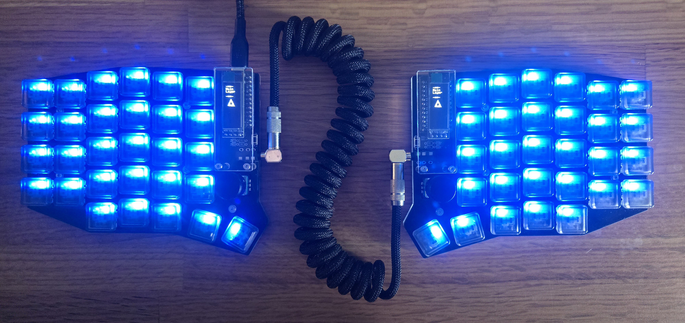

<h1 align="center" style="font-size: 30px">A logical problem solver at his core.</h1>

I'm mostly involved with PowerShell and GoLang to generate tooling with the goal of increasing efficiency. I have a slight obsession with configuring my <a href="https://github.com/Printoiid/Mournhold/tree/main/SofleKM/Lizardbutt">QMK keyboard</a> and my <a href="https://github.com/Printoiid/Mournhold/tree/main/nvim">Neovim setup.</a> On the side, I enjoy 3D modeling/printing, as well as Roguelike and RTS games.

    Yes, my git graph is lacking, I'm sad about it too. It's a work in progress. 
    ヽ(　￣д￣)ノ

---

Current keyboard: Sofle Choc V2

## Current Projects

- [My Neovim configuration](https://github.com/Printoiid/Mournhold/tree/main/nvim) My work environment
- [Multiboard Automation](https://github.com/Printoiid/Multiboard-Automation): This is a small PowerShell module to grab every [Thangs](https://thangs.com) listing for Multiboard parts for an easier consumer experience.
- [QMK Configuration](https://github.com/Printoiid/Mournhold/tree/main/soflekm/Lizardbutt) My keyboard layout, and configuration

## Homelab applications and technologies I use

| Name          | Function                      |
| ---           | ---                           |
| Proxmox       | Hypervisor                    |
| OpnSense      | Firewall/Router               |
| Talos         | Kubernetes Operating System   |
| Docker Server | Docker Host                   |
| ArgoCD        | CI/CD                         |
| Hubble        | K8s Network Observability     |
| Cilium        | K8s Network Configuration     |
| Linkwarden    | Bookmark Application          |
| Mealie        | Recipe Management Application |
| Jellyfin      | Media Server                  |
| Cloudflare    | ACME/Certificates/WAN Gateway |

... And more to come.
